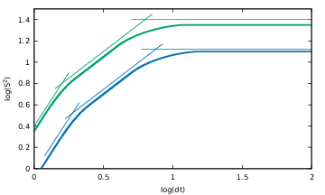

# Cubic splines for gnuplot

Library to create [cubic hermite splines](https://en.wikipedia.org/wiki/Cubic_Hermite_spline) in [gnuplot](http://www.gnuplot.info/). Cubic splines are C1 piece-wise polynomial functions (of local degree 3) for which are specified value and first-derivative of the control points.



I used this library to create sketches of second-order [Lagrangian structure functions for turbulence (e.g. [Fig.3 in this paper](https://pure.tue.nl/ws/files/3141669/Metis218551.pdf)) as in the example above.


### Usage 

```gnuplot

load "cubic_hermite_spline.lib.gnu"
set parametric

plot t, cubHerMulti5t(x0,u0, x1,u1, x2,u2, x3,u3, x4,u4, x5,u5 ,t)

```

Here `xi,ui` are, respectively, the value of the spline and of its first derivative.

The functions `cubHerMulti2t`, ..., `cubHerMulti5t` expect, respectively, 2, ... , 5 input control points.

### TODO 

The library can be easily extended to more control points; the API as well should be modified to accept arrays as inputs.

